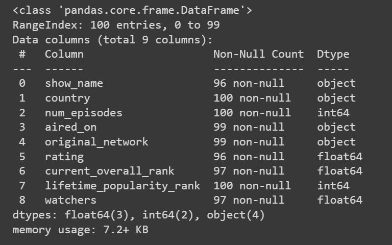

# Ex-01_DS_Data_Cleansing

Colab Link - https://colab.research.google.com/drive/11SbMxPwpmYJAzvY_7d__smBXP_wGUKUa?usp=sharing

Github Link - https://github.com/KATHIR1611/Ex-01-Data-Cleaning

# AIM
To read the given data and perform data cleaning and save the cleaned data to a file.

# Explanation
Data cleaning is the process of preparing data for analysis by removing or modifying data that is incorrect ,incompleted , irrelevant , duplicated or improperly formatted. Data cleaning is not simply about erasing data ,but rather finding a way to maximize datasets accuracy without necessarily deleting the information.

# ALGORITHM
## STEP 1
Read the given Data

## STEP 2
Get the information about the data

## STEP 3
Remove the null values from the data

## STEP 4
Save the Clean data to the file

# CODE
Developed by:Kathirvelan.K

Register number:212221220026

```
import pandas as pd
df=pd.read_csv("Data_set.csv")
print(df)
df.head(11)

df.info()

df.isnull()

df.isnull().sum()

df['show_name']=df['show_name'].fillna(df['aired_on'].mode()[0])
df['aired_on']=df['aired_on'].fillna(df['aired_on'].mode()[0])
df['original_network']=df['original_network'].fillna(df['original_network'].mode()[0])
df.head()

df['rating']=df['rating'].fillna(df['rating'].mean())
df['current_overall_rank']=df['current_overall_rank'].fillna(df['current_overall_rank'].mean())
df.head()

df['watchers']=df['watchers'].fillna(df['watchers'].median())
df.head()

df.info()

df.isnull().sum()

```
# OUPUT





# Result

      Thus using the given dataset data cleaning is completed.


